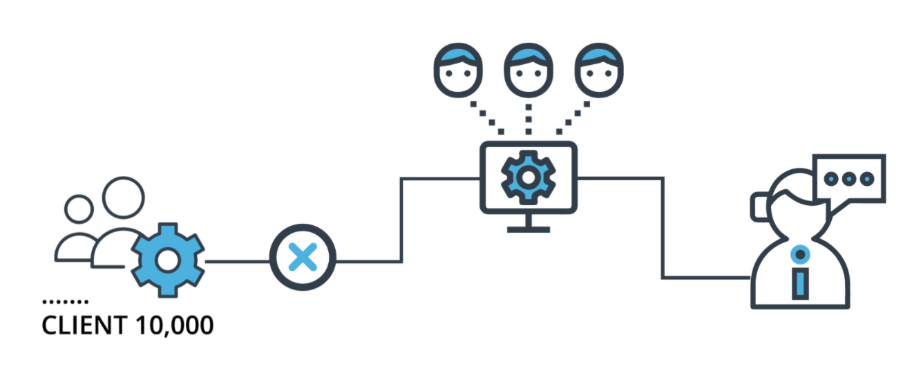

# Udacity Machine Learning DevOps Engineer Nanodegree Program Projects

## Projects

### 01. [Predict Customer Churn with Clean Code](01-Predict-Customer-Churn-with-Clean-Code)

  
Description

  Applied clean code principles to identify credit card customers likely to churn, focusing on testing, logging, and best coding practices.

### 02. [ML Pipeline for Short-term Rental Prices in NYC](02-Build-ML-Pipeline-for-short-term-rental-prices)

  
Description

  Built a reusable machine learning pipeline to predict short-term rental prices in NYC, enabling continuous model retraining with new data.

### 03. [Deploying a ML Model on Heroku with FastAPI](03-Deploying-a-Scalable-ML-Pipeline-in-Production)

  
Description

  Deployed a machine learning model on Render using FastAPI, incorporating Git and DVC for tracking, and establishing a CI/CD pipeline for deployment.

### 04. [Dynamic Risk Assessment System](04-ML-Model-Scoring-and-Monitoring)

  
Description

  Developed a dynamic risk assessment system to predict attrition risk, automating the ML process including model scoring and monitoring.

## Udacity - Graduation Certificate

